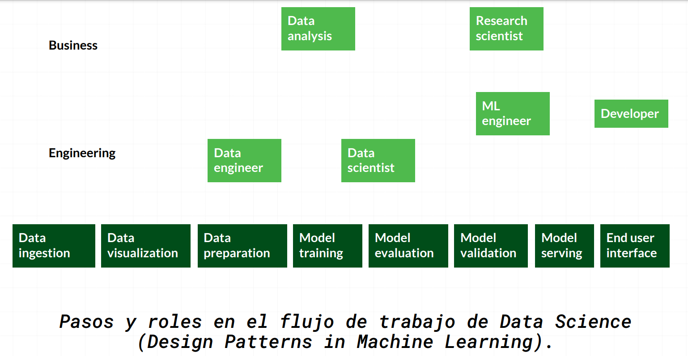
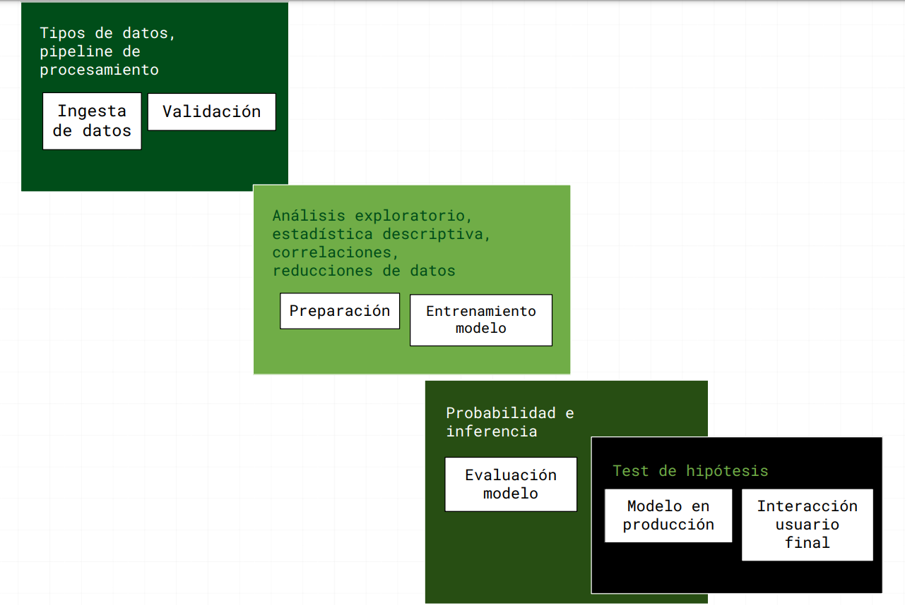

# Curso de Matemáticas para Data Science: Estadística Descriptiva

La estadística descriptiva es una de la herramientas fundamentales para cualquier científico de datos. notas del curso donde aprenderé a entender los principales conceptos de esta rama, desarrollar gráficas a través de datos y aplicar estadística para un análisis profundo.

***"Con frecuencia construimos un caso estadístico con datos imperfectos, como resultado hay numerosas razones por las cuales individuos intelectuales respetables pueden no estar de acuerdo sobre los resultado estadísticos"***  -Charles Wheelan

## Porque aprender estadística?

- Resumir grandes cantidades de información.
- Tomar mejores decisiones (¿o peores?).
- Responder preguntas con relevancia social.
- Reconocer patrones en los datos.
- Descubrir a quienes usan estas herramientas con fines nefastos.

## Flujo de trabajo en Data Science

